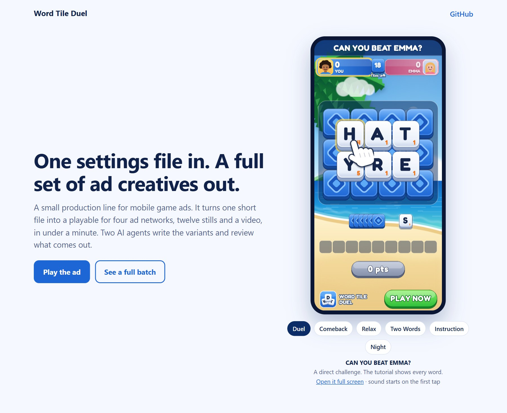
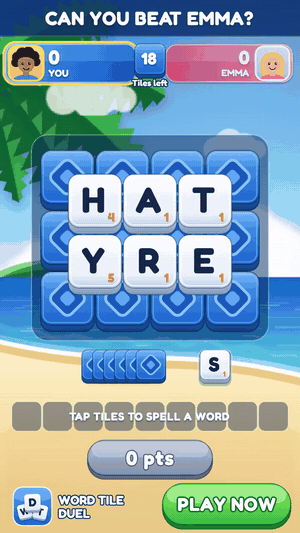
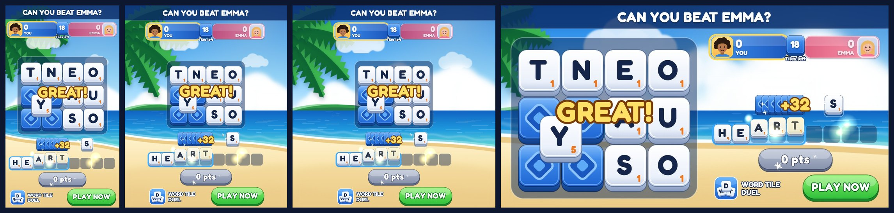
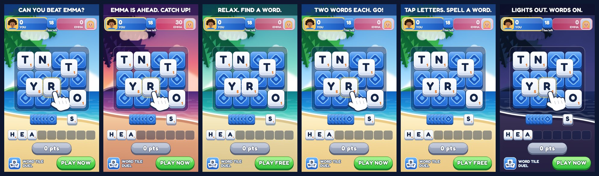
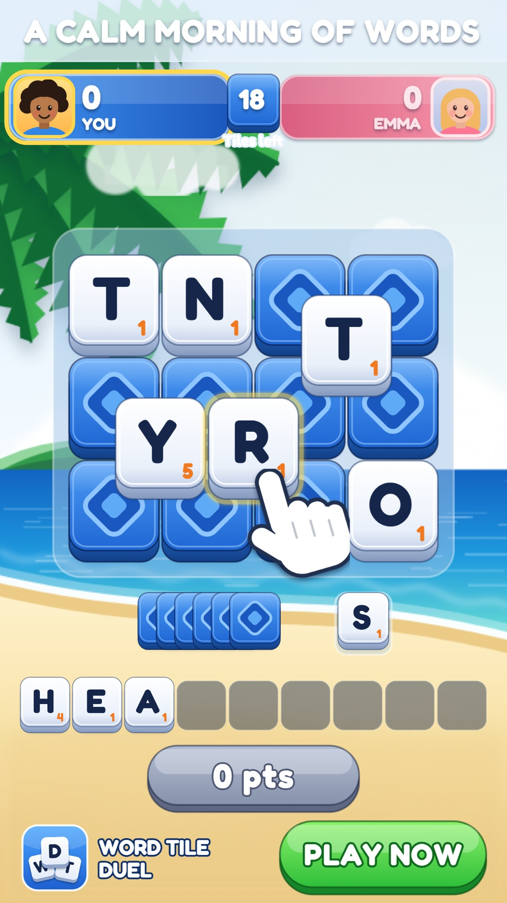
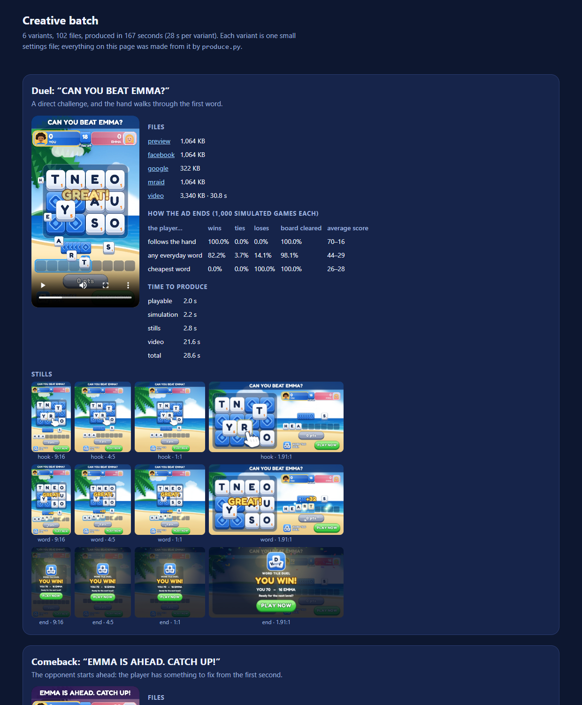

# word-tile-playable

<a href="https://omeraydin0.github.io/word-tile-playable/"></a>

**Live page: https://omeraydin0.github.io/word-tile-playable/** <br>
Play the ad, switch between the six variants, watch the videos.

A small production line for mobile game ad creatives. One short settings file goes in. A
playable ad for four networks, twelve stills and a video come out, in under a minute.

## Why

I went through Meta's Ad Library, looking at the most-shown "tile" game ads running in
Turkey (October 2026). Most were 30-second videos, and nearly all of them said one of two
things: "only 1% can beat this" or "relax".

I don't think that is for lack of ideas. One idea means a playable, a video, a still for
every placement and a package for every network. That is about twenty files. When an idea
costs that much, you only try a few. So I made trying one more idea cheap.

## One file in

<table>
<tr>
<td valign="top">

A variant's settings file, shortened:

```json
{
  "label": "Comeback",
  "headline": "EMMA IS AHEAD. CATCH UP!",
  "ctaLabel": "PLAY NOW",
  "opponentName": "EMMA",
  "theme": "sunset",
  "botStartScore": 30
}
```

Out, for that variant:

- **4 playables**: Meta, Google, an MRAID build for AppLovin, Unity and ironSource, and a
  preview. If a file is too big for its network, the build fails.
- **12 stills**: three moments of the ad, each in 9:16, 4:5, 1:1 and 1.91:1.
- **1 video**: the ad played from start to finish, with sound.
- **1 manifest**: what was made, from which settings, and how long it took.

</td>
<td align="center" width="270">

</td>
</tr>
</table>

<p align="center"></p>

## Six variants so far

<p align="center"></p>

| Variant | Headline | The idea | Written by | |
|---|---|---|---|---|
| Duel | CAN YOU BEAT EMMA? | A direct challenge | me | [video](https://omeraydin0.github.io/word-tile-playable/creatives/duel/video.mp4) |
| Comeback | EMMA IS AHEAD. CATCH UP! | The opponent starts 30 points up | me | [video](https://omeraydin0.github.io/word-tile-playable/creatives/comeback/video.mp4) |
| Relax | RELAX. FIND A WORD. | No tutorial unless the player waits | me | [video](https://omeraydin0.github.io/word-tile-playable/creatives/relax/video.mp4) |
| Two Words | TWO WORDS EACH. GO! | A shorter game, and the headline says so | agent | [video](https://omeraydin0.github.io/word-tile-playable/creatives/two-words/video.mp4) |
| Instruction | TAP LETTERS. SPELL A WORD. | No question, only what to do | agent | [video](https://omeraydin0.github.io/word-tile-playable/creatives/instruction/video.mp4) |
| Night | LIGHTS OUT. WORDS ON. | Same ad, dark colours the agent chose | agent | [video](https://omeraydin0.github.io/word-tile-playable/creatives/night/video.mp4) |

## The steps

```
brief -> writer agent -> settings file -> rule check -> produce -> reviewer agent -> report
```

Two AI agents sit at the ends. One writes settings files from a one-page brief. The other
looks at the finished stills and says PASS or REVISE. They run in Claude Code and their
instructions are in `.claude/`. Everything that has to be counted is counted by ordinary
code.

## What is checked before an ad goes out

- **Is the copy true?** No percentages, no "best game", no "she's ahead" unless she really
  starts ahead. "Only 1%" would be refused.
- **Can the viewer win?** The ad plays itself 3,000 times. Someone who does what the
  tutorial shows wins every time.
- **Does it read at every size?** The reviewer agent opens the stills and checks.
- **Does it fit every screen?** The ad is laid out on 23 screen sizes. The check fails if
  anything overlaps, runs off the screen or is too small to tap.
- **Can the reviewer say no?** It passed the first three variants, which told me little.
  So I broke two on purpose and showed them to it without saying so. It rejected both, for
  the right reasons. They are in [`docs/probes/`](docs/probes/README.md).

<p align="center"><br><sub>One of the two I broke on purpose. The reviewer sent it back because the headline can't be read.</sub></p>

## When the game changes

The game team changes the interface and every creative you have is out of date.

I went through that four times in one evening, comparing my ad with the real game and
fixing what was different. Each time one command remade everything: 24 playables, 72
stills and 6 videos, in a few minutes. By hand that is 102 files, every time.

<p align="center"></p>

## How long one variant takes

From the last batch, on my laptop:

| | seconds |
|---|---|
| playable for four networks | 2 |
| 3,000 simulated games | 2 |
| 12 stills | 3 |
| video with sound | 22 |
| **total** | **28** |

The six took between 23 and 29 seconds each. Writing three variants takes the agent about
half a minute, and so does one review.

## What is missing

- Nothing has run on an ad network. I have no click, install or cost numbers.
- The builds follow each network's published rules, but I haven't put them through the
  networks' own test tools.
- The agents have done one brief: three variants, revised once, and eight reviews.
- I have played it on one real phone. The other screen sizes were checked in a desktop
  browser.

More in [`docs/NOTES.md`](docs/NOTES.md): the hardest part, what the agents got wrong, what
I would measure first, and how the ad is put together.

## Running it

```bash
pip install -r requirements.txt
python build.py              # the ads, into dist/
python produce.py            # every variant, into creatives/
python tools/variants.py     # only check the settings files
python tools/screens.py      # only check the screen sizes
python -m pytest -q          # 85 tests
```

The game in the ad is modelled on Word Tiles GO. The name, the art and the music are mine.
This is not that game's ad.

Licences: PixiJS (MIT), GSAP (GreenSock standard licence), Fredoka (SIL OFL), ENABLE word
list (public domain). Details are in `vendor/`.
