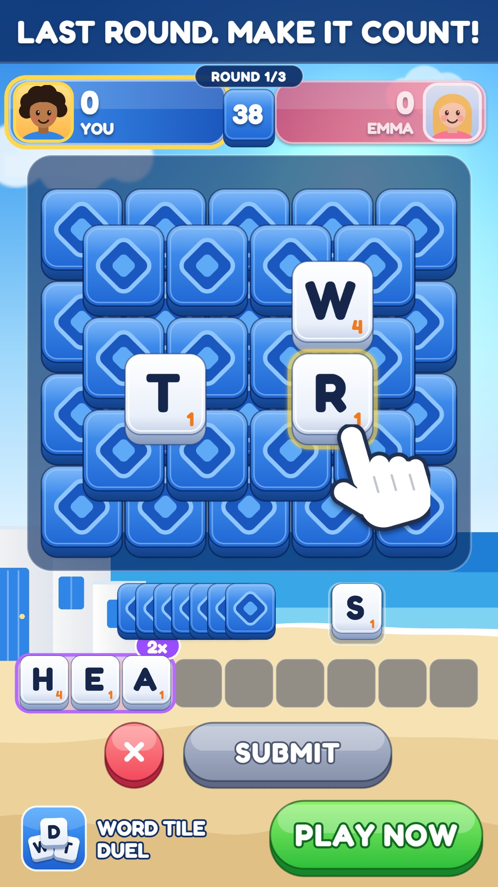

# Probes for the reviewer

Two variants with a fault planted in each. Both pass `tools/variants.py`, because the
fault is not one a rule can see; the `creative-reviewer` agent is supposed to.

| File | The fault | What a correct review says |
|---|---|---|
| `harbor.json` | The band behind the headline is nearly white, and so is the headline. | REVISE: the headline is hard to read, naming the pale `strip` colour. |
| `last-round.json` | The headline says "LAST ROUND", but it is round 1 of 3 at 0-0. | REVISE: the headline is false; the settings do not make it a last round. |

To use them: copy one into `variants/`, run `python produce.py <name>`, give the result to
the reviewer without saying it is a probe, then delete the variant and its folder in
`creatives/`.

First run, 5 October 2026: both were caught, each for the planted reason. The reviewer
also found a second, unplanted fault in `harbor` (a "calm" headline over a tutorial hand).
Two probes show the reviewer can refuse; they do not show how often it would.

